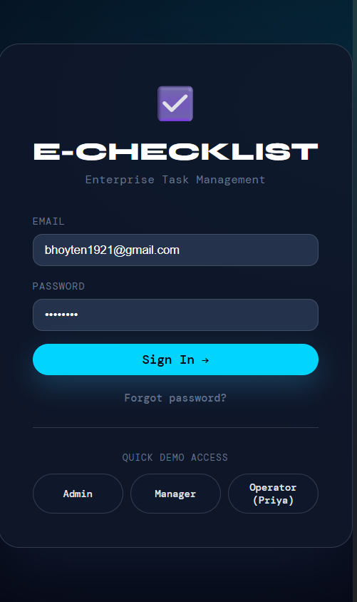
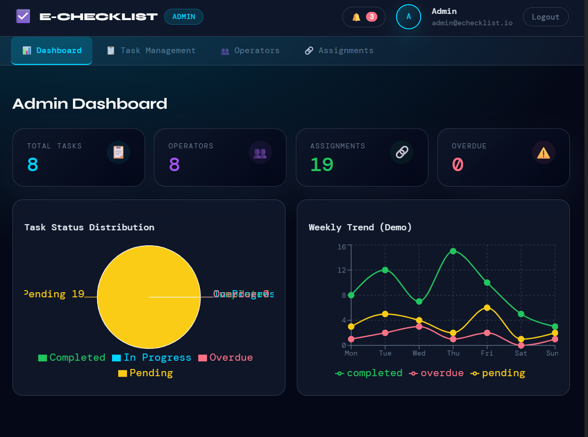
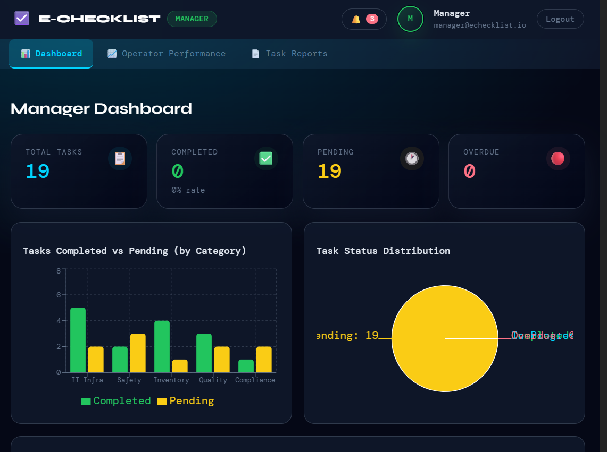
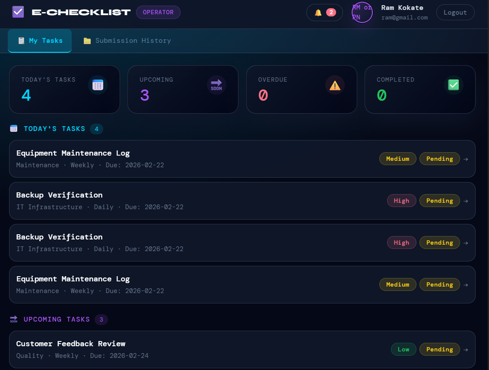

# E-Checklist Task Monitoring Web Application

## Project Overview
E-Checklist is a web-based task monitoring system that allows administrators to assign tasks, track progress and monitor operator performance.

## Technologies Used
React  
Firebase  
JavaScript  

## Features
• Admin dashboard with analytics  
• Operator management  
• Task assignment system  
• Weekly task performance tracking  
• Task status monitoring  

## Dashboard Modules
Dashboard  
Operators  
Assignments  
Tasks  
Reports  
## Live Application

Live Demo: [https://your-app-link.com](https://echecklist-app.web.app/)

## Source Code

GitHub Repository: https://github.com/bbhoyteN/Namdev-Data-Analytics-Portfolio/tree/main/EChecklist-Web-App
## Application Preview

