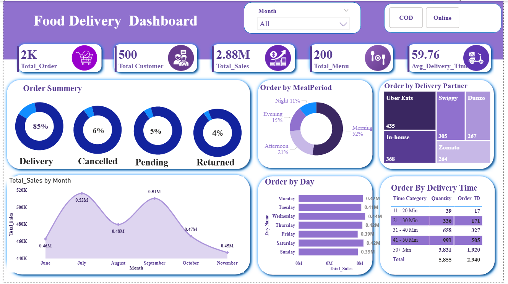

# Food Delivery Analytics Dashboard

## Project Overview
This project analyzes food delivery data to understand order trends, customer behavior and delivery performance.

## Tools Used
- Power BI
- Excel
- Data Visualization

## Key Insights
- Total orders and customers
- Delivery partner performance
- Order status distribution
- Sales trends by time

## Dashboard Pages
- Home Dashboard
- Performance Dashboard
- Order Analysis Report

