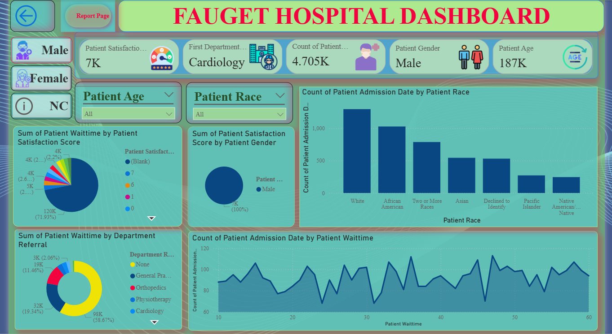
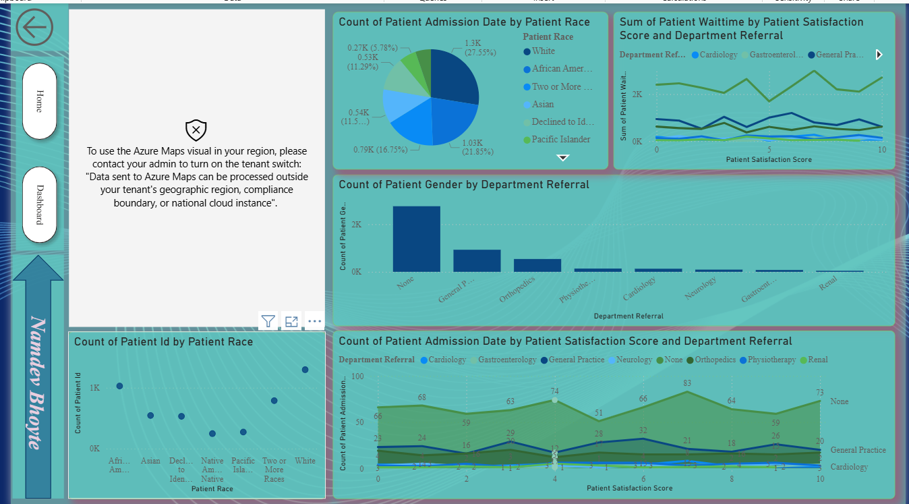

# Hospital Patient Analytics Dashboard

## Project Overview
This project analyzes hospital emergency room data to understand patient flow, wait times, and satisfaction.

## Tools Used
- Power BI
- SQL
- Excel

## Key Insights
- Patient wait time analysis
- Admission trends
- Patient satisfaction score
- Department referral patterns

## Dashboard Preview

