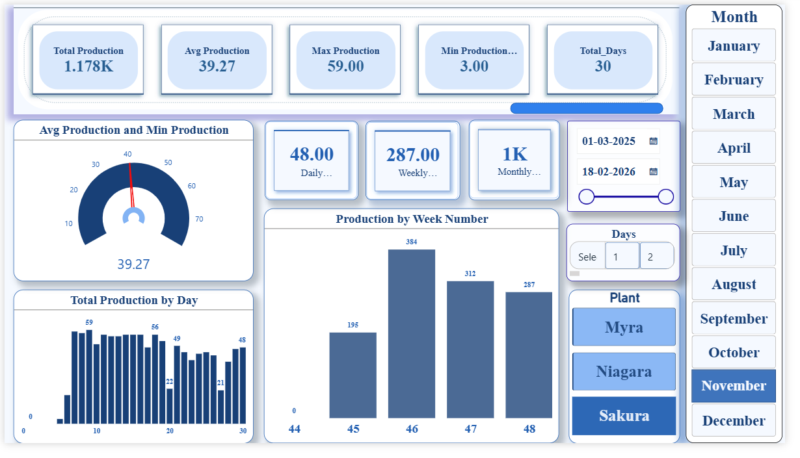
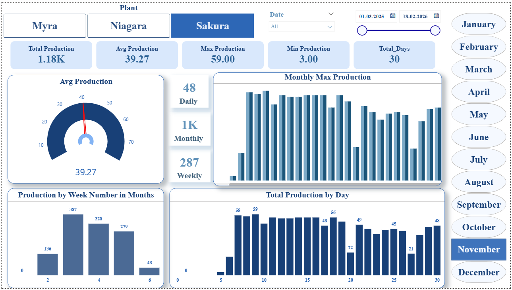

# Solar Power Production Dashboard

## Project Overview
This project analyzes solar power generation data from multiple solar plants to monitor performance and production trends.

## Tools Used
Power BI  
SQL  
Excel  

## Key Insights
• Total solar power production  
• Production comparison by plant  
• Monthly production trends  
• Daily power generation analysis  

## Plants Analyzed
Myra  
Niagara  
Sakura  

## Dashboard Preview

